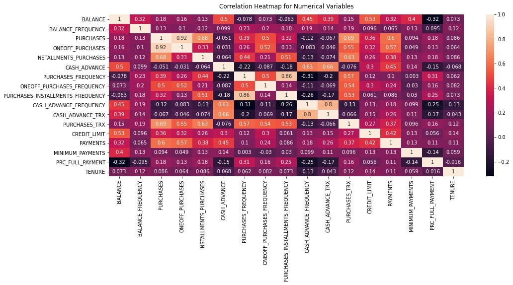
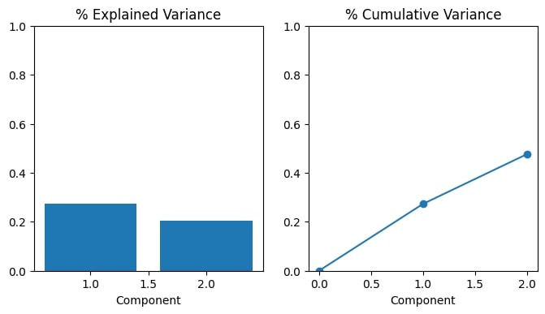
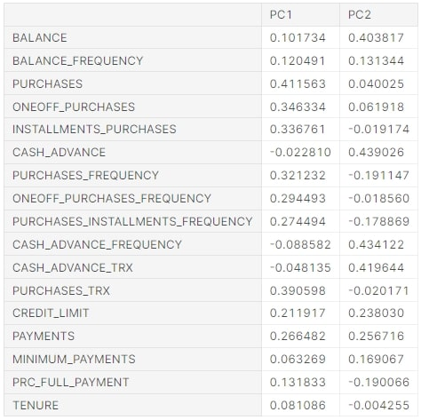
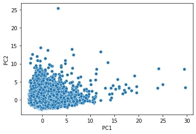
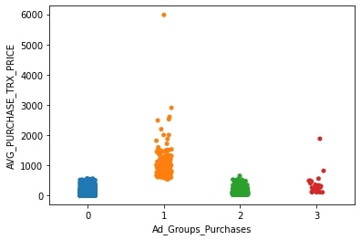
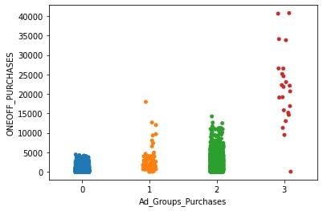
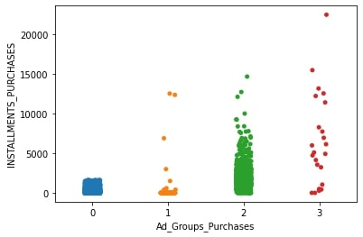
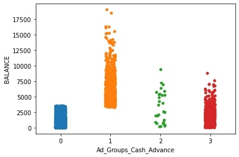
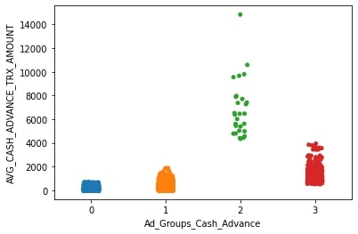

# Project 4: Credit Card Users Cluster Analysis (Python/HTML/Heroku)

This repository is for the analysis, clustering, and modeling done with a credit card history dataset. Below you will find an overview of the data, code, and results. The goal was to create a project where I perform an exploratory data analysis (EDA) including a principal component analysis (PCA), cluster analaysis, feature engineering, apply machine learning algorithms to predict clusters based on credit card usage, and create a [deployed application with a front end](https://ad-advisor.herokuapp.com/) to productionize the best performing model. The repo for the app can be found [here](https://github.com/MichaelBryantDS/credit-card-cluster-app).

### Code Used 

**Python Version:** 3.7.10 <br />
**Packages:** pandas, numpy, scipy, sklearn, matplotlib, seaborn, flask, shap, eli5, pickle<br />
**For Web Framework Requirements:**  ```pip install -r requirements.txt```  

## Heart Disease Dataset

The dataset was gathered from [Kaggle](https://www.kaggle.com/arjunbhasin2013/ccdata). The dataset contains 18 variables and 8950 patient records.

### Variables

`CUST_ID`, `BALANCE`, `BALANCE_FREQUENCY`, `PURCHASES`, `ONEOFF_PURCHASES`, `INSTALLMENTS_PURCHASES`, `CASH_ADVANCE`, `PURCHASES_FREQUENCY`, `ONEOFF_PURCHASES_FREQUENCY`, `PURCHASES_INSTALLMENTS_FREQUENCY`, `CASH_ADVANCE_FREQUENCY`, `CASH_ADVANCE_TRX`, `PURCHASES_TRX`, `CREDIT_LIMIT`, `PAYMENTS`, `MINIMUM_PAYMENTS`, `PRC_FULL_PAYMENT`, `TENURE`

## Files

### eda-cleaning-engineering-modeling.py

This file contains the EDA, data cleaning, feature engineering, clustering, and modeling. The EDA is performed using descriptive statistics, histograms to determine distributions, and a correlation heatmap using the Pearson correlation coefficient. Features are engineered based on the principal component analysis (PCA) results. Other feature engineering includes the creation of clusters and numerical features are scaled using MinMaxScaler. Two clusters are created based on the prinipal components and models are created to predict classification. The scalers and models are pickled after fitting for use with productionization.

## Results

### EDA

I looked at the distributions of the data and the correlations between variables. Below are some of the highlights:

<div align="center">
  
<figure>
<br/>
  <figcaption>Figure 1: Correlation heatmap using Pearson's correlation coeffient.</figcaption>
</figure>
<br/><br/>
  
</div>

<div align="center">
  
<figure>
<br/>
  <figcaption>Figure 2: Plots after using the elbow method for determining the number of principal components where about 50% of the variance is explained by two.</figcaption>
</figure>
<br/><br/>
  
</div>

<div align="center">
  
<figure>
<br/>
  <figcaption>Figure 3: Weights showing how variables change along the principal components where PC1 is characterized by purchases and PC2 is characterized by balance and cash advances.</figcaption>
</figure>
<br/><br/>
  
</div>

<div align="center">
  
<figure>
<br/>
  <figcaption>Figure 4: Plotting data using the principal components as axes to determine how data varies with each axis.</figcaption>
</figure>
<br/><br/>
  
</div>

### Data Cleaning

I cleaned the data to make the dataset usable for modeling. I made the following changes:

* Imputed values in `MINIMUM_PAYMENTS` and `CREDIT_LIMIT` with the median values

### Feature Engineering

I feature engineered using the dataset for modeling. I made the following changes:

* Created variables `AVG_PURCHASE_TRX_PRICE`, `BALANCE_TO_CREDIT_LIMIT`, and `AVG_CASH_ADVANCE_TRX_AMOUNT`
* Created two sets of four clusters:
  * The first set `Ad_Groups_Purchases` is based on `AVG_PURCHASE_TRX_PRICE`, `ONEOFF_PURCHASES`, and `INSTALLMENTS_PURCHASES`
  * The second set `Ad_Groups_Cash_Advance` is based on `BALANCE` and `AVG_CASH_ADVANCE_TRX_AMOUNT`

<div align="center">

<figure>
<br/>
  <figcaption>Figure 5: Plot showing differences in AVG_PURCHASE_TRX_PRICE between clusters in the Ad_Groups_Purchases set.</figcaption>
</figure>
<br/><br/>
  
</div>

<div align="center">

<figure>
<br/>
  <figcaption>Figure 6: Plot showing differences in ONEOFF_PURCHASES between clusters in the Ad_Groups_Purchases set.</figcaption>
</figure>
<br/><br/>
  
</div>

<div align="center">

<figure>
<br/>
  <figcaption>Figure 7: Plot showing differences in INSTALLMENTS_PURCHASES between clusters in the Ad_Groups_Purchases set.</figcaption>
</figure>
<br/><br/>
  
</div>

<div align="center">

<figure>
<br/>
  <figcaption>Figure 8: Plot showing differences in BALANCE between clusters in the Ad_Groups_Cash_Advance set.</figcaption>
</figure>
<br/><br/>
  
</div>

<div align="center">

<figure>
<br/>
  <figcaption>Figure 9: Plot showing differences in AVG_CASH_ADVANCE_TRX_AMOUNT between clusters in the Ad_Groups_Cash_Advance set.</figcaption>
</figure>
<br/><br/>
  
</div>

### Model Building

First, I split the data into train and tests sets with a test set size of 25%.

I then hyperparameter tuned the models with five-fold cross-validation and evaluated them using accuracy.

The models I used were:
* **kNeighborsClassifier** because I thought since I used a clustering algorithms to create the groups that classifying based on neighbors might be effective.
* **RandomForestClassifier** because I wanted to try a tree model and this classifier is known to give good results even without hyperparameter tuning.

### Model Performance

The models were judged based on accuracy and each performed similarly.
* For the first classification based on classifying records into the `Ad_Groups_Purchases` clusters **RandomForestClassifier** had the best training accuracy at 99.4% and a test accuracy of 99.3%. 
* For the first classification based on classifying records into the `Ad_Groups_Cash_Advance` clusters **kNeighborsClassifier** had the best training accuracy at 99.7% and a test accuracy of 99.8%. 

## Productionization

## Resources

1. [Kaggle: Credit Card Dataset](https://www.kaggle.com/arjunbhasin2013/ccdata)
